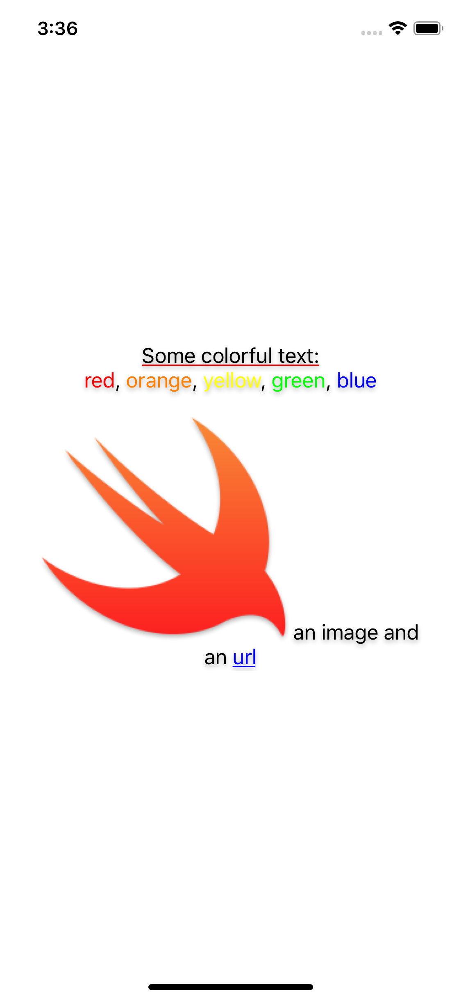

# OzStringKit


[](https://github.com/JamitLabs/Accio)
[](https://github.com/apple/swift-package-manager)


[](https://github.com/koznobikhin/OzStringKit/blob/master/LICENSE.txt)

NSAttributedString creation with Swift 5 string interpolation

## Example

```Swift
let swiftLogo = UIImage(named: "SwiftLogo")!
let url = URL(string: "https://swift.org/")!

let attributedText = attributedString("""
    \("Some colorful text:", .underline(.single, color: .red))
    \("red", .color(.red)), \("orange", .color(.orange)), \("yellow", .color(.yellow)), \
    \("green", .color(.green)), \("blue", .color(.blue))

    \(image: swiftLogo) an image and an \("url", .link(url))
    """)

let shadow = NSShadow()
shadow.shadowColor = UIColor.black.withAlphaComponent(0.3)
shadow.shadowBlurRadius = 4.0
shadow.shadowOffset = CGSize(width: 0.0, height: 2.0)
self.label.attributedText = attributedString("\(attributedText, .alignment(.center), .shadow(shadow))")

```



## Installation

### Swift Package Manager

Add this to your project using Swift Package Manager. In Xcode that is simply: File > Swift Packages > Add Package Dependency... and you're done.

```swift
dependencies: [
    .package(url: "https://github.com/koznobikhin/OzStringKit.git", .upToNextMajor(from: "0.0.1"))
]
```

### Accio

[Accio](https://github.com/JamitLabs/Accio) is a dependency manager based on SwiftPM which can build frameworks for iOS/macOS/tvOS/watchOS. Therefore the integration steps of OzStringKit are exactly the same as described above. Once your `Package.swift` file is configured, run `accio update` instead of `swift package update`.

### CocoaPods

If you are already using [CocoaPods](http://cocoapods.org), just add 'OzStringKit' to your `Podfile` then run `pod install`. 
For more detailed usage and installation instructions, visit their website.

```ruby
pod 'OzStringKit'
```

## Author

Konstantin Oznobikhin


## License

OzStringKit is available under the MIT license. See [the LICENSE file](https://github.com/koznobikhin/OzStringKit/blob/master/LICENSE.txt) for more information.
