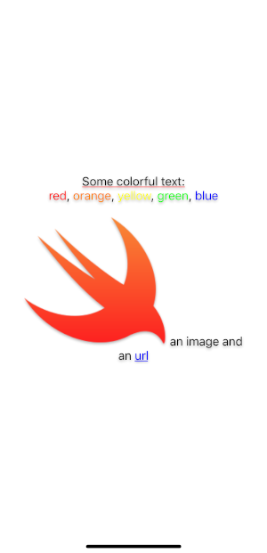

# OzStringKit
NSAttributedString creation with Swift 5 string interpolation

## Installation

Add this to your project using Swift Package Manager. In Xcode that is simply: File > Swift Packages > Add Package Dependency... and you're done. Alternative installations options are shown below for legacy projects.

### CocoaPods

If you are already using [CocoaPods](http://cocoapods.org), just add 'OzStringKit' to your `Podfile` then run `pod install`.

## Author

Konstantin Oznobikhin

## License

OzStringKit is available under the MIT license. See [the LICENSE file](LICENSE) for more information.
